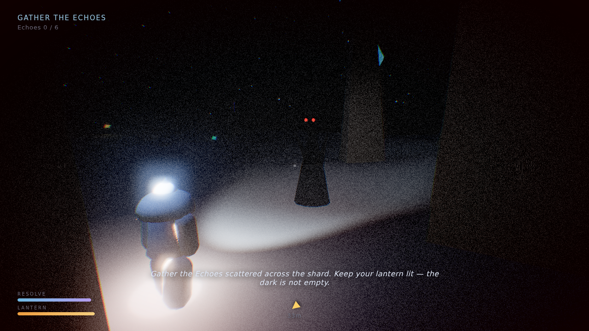

# COSMIC FALL

**A 3D third-person cosmic-horror descent — built in one session, no asset files, no build step.**

You are the last Warden aboard the fallen research shard *Erebus*, adrift in the
void after it fell through a wound in the sky. Reality is coming apart. Far below,
**the Sleeper** turns in its long dream — and it is beginning to wake. Gather the
six **Echoes** scattered across the shard to wake the **Beacon**, then reach its
light and climb out of the fall — before the dark finds you first.

This is a spiritual sequel to the 2D platformer *COSMICFALL*, re-imagined as a
fully 3D, third-person experience: same universe, same dread, new dimension.



## Play

No build step, no dependencies to install — Three.js is vendored locally, so it
opens straight from disk (a static server is only needed to satisfy ES-module
CORS rules):

```bash
python3 -m http.server 8099
# then open http://localhost:8099
```

Or `npm start`.

### Controls

| Action | Key |
| --- | --- |
| Move | `W A S D` |
| Look | Mouse (click to capture) |
| Sprint | `Shift` |
| Lantern on/off | `F` |
| Pause | `Esc` |

Best played with sound on, in the dark.

## The loop

- **Light is life.** Your lantern carves the world out of the black and holds
  your **Resolve** together. But it burns fuel — leave it lit and it will fail;
  douse it to save fuel and the dark starts to bleed your Resolve away.
- **The Sleeper stirs.** Every Echo you claim wakes it a little more — its glow
  swells from the abyss, dread rises, and the world's fog thickens.
- **The Stalker hunts.** As dread climbs, a wraith emerges from the dark and
  closes on you. Its two red eyes are the only warning. **Face it with the
  lantern beam** to burn it back; turn away and it charges. It is the real
  killer — the dark only bleeds you slowly.
- **Escape.** Six Echoes light the Beacon. Reach it and ascend.

## What's under the hood

Everything is generated in code — no textures, no models, no audio files, no
engine. Just Three.js (vendored) and ~2k lines of JavaScript.

- **World** — a procedurally displaced, torn shard of land floating in a star
  dome, with tapered monoliths (glowing veins as landmarks), drifting debris,
  rising motes, and the colossal **Sleeper** below whose eye slowly opens as
  dread grows.
- **The Warden** — a procedural rigged character (hooded cloak, swinging limbs,
  walk cycle, squash-and-bob) with a hand lantern that casts a real spotlight +
  warm glow, and a soft fill so the silhouette always reads.
- **Third-person camera** — over-the-shoulder follow rig with orbit, zoom,
  ground-clip avoidance, and damped motion.
- **Procedural audio** (`audio.js`) — layered WebAudio: a sub drone, breathing
  wind, a shimmer pad, whisper swells, and a **heartbeat that quickens with
  dread** — plus synthesized pickup / stinger / beacon SFX.
- **Post-processing** (`postfx.js`) — `EffectComposer` with bloom and a custom
  grade pass: chromatic aberration, vignette, film grain, a cool color grade,
  and a heartbeat lens-breathing distortion — all driven by your dread level.
- **Sanity / dread model** (`main.js`) — Resolve regenerates in light and drains
  in dark and under threat; dread feeds back into the audio, the post FX, the
  Sleeper's waking, and the Stalker's aggression.

## Project layout

```
index.html          importmap + boot
styles.css          HUD / menus / narrative cards
src/
  main.js           state machine, sanity/dread, main loop, wiring
  world.js          terrain, monoliths, debris, the Sleeper, fog, stars
  player.js         Warden rig + third-person controller + lantern
  creature.js       the Stalker AI
  relics.js         Echoes + the Beacon
  audio.js          procedural WebAudio engine
  postfx.js         EffectComposer + dread grade shader
  hud.js            DOM HUD, menus, typewriter narrative cards
  story.js          narrative content
  input.js          keyboard + mouse + pointer-lock
  util.js           seeded RNG + value noise / fbm
vendor/three/       Three.js r160 (vendored so it runs offline)
tools/smoke.mjs     headless Chromium QA harness
```

## Quality gate

The game is verified end-to-end by a headless Chromium harness (`npm test`),
which loads it, drives title → prologue → play, and asserts:

- **zero** console / page errors across the whole chain,
- the win path is reachable (all Echoes → Beacon → ascent),
- the Stalker spawns as dread rises,
- the dark is lethal (Resolve → 0 → consumed),

capturing screenshots of each stage (title, gameplay, the Stalker, win) for
visual review.

## Honest note on scope

For a from-scratch, single-session, dependency-light 3D web game, this is a
polished, complete, and bug-checked vertical slice. "Triple-A" in the literal
sense — photoscanned assets, mocap, dozens of hours — is hundreds of people over
years; this doesn't pretend to be that. What it is: a genuinely atmospheric,
fully playable 3D horror experience with a real character controller, a real
threat loop, procedural audio and post-processing, and a beginning, middle, and
two endings.
